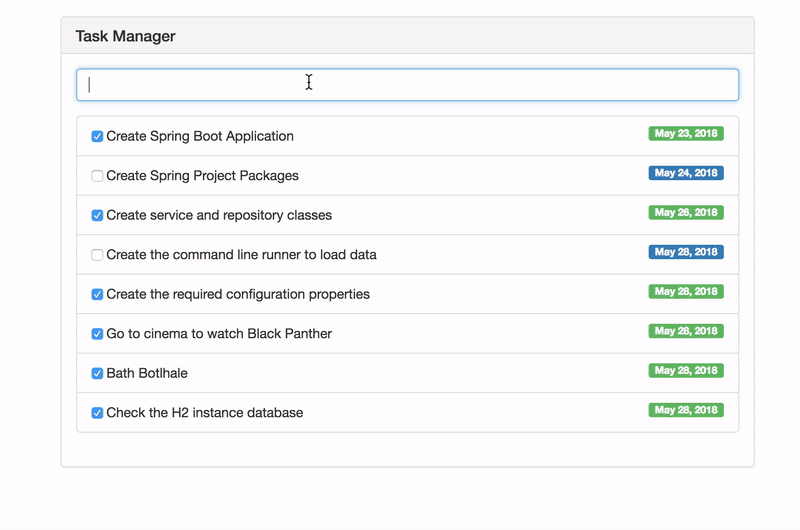

# Tasks Manager
Angular 6 and Spring Boot 2.0.2 are currently industry frameworks that have changed how developers in the Web front-end 
and back-end develop Web applications. In this project, we take a close look into integrating the two to work as a single unit. 
The two frameworks are built separately, in the case of a team environment, thereafter the build process packages the application into a single coherent JAR file. 

## Demo


## Setup
``Angular``: To run the front-end application, execute ``$ yarn start``. The application starts on port 4200 with a proxy to the backend on port 8080.

``Spring Boot``: To run the back-end application, execute execute the TasksApplication class from within Eclipse or IntelliJIDEA.

## Integration
* Build the Angular project by executing: ``$ yarn build``. This will build the project and copy build artefacts into the dist folder
* Thereafter, the dist folder will be copied from the front-end to the back-end static folder
* Execute ``mvn package`` to package the application into a JAR file. Jar file located in ``target/tasks-0.0.1-SNAPSHOT.jar`` folder

Below are yarn script commands that are executed:
```
"build": "ng build --prod",

"postbuild": "yarn run deploy",

"predeploy": "rimraf ../resources/static/ & mkdirp ../resources/static",

"deploy": "copyfiles -f dist/** ../resources/static"
```
 
## What's Next?
* Write Unit tests for both the back-end and front-end to complete the application
* Move the application to JHipster
* Write UI automated tests using Cypress

## License
```
The MIT License (MIT)

Copyright (c) 2018 Mr Modise

Permission is hereby granted, free of charge, to any person obtaining a copy
of this software and associated documentation files (the "Software"), to deal
in the Software without restriction, including without limitation the rights
to use, copy, modify, merge, publish, distribute, sublicense, and/or sell
copies of the Software, and to permit persons to whom the Software is
furnished to do so, subject to the following conditions:

The above copyright notice and this permission notice shall be included in all
copies or substantial portions of the Software.

THE SOFTWARE IS PROVIDED "AS IS", WITHOUT WARRANTY OF ANY KIND, EXPRESS OR
IMPLIED, INCLUDING BUT NOT LIMITED TO THE WARRANTIES OF MERCHANTABILITY,
FITNESS FOR A PARTICULAR PURPOSE AND NONINFRINGEMENT. IN NO EVENT SHALL THE
AUTHORS OR COPYRIGHT HOLDERS BE LIABLE FOR ANY CLAIM, DAMAGES OR OTHER
LIABILITY, WHETHER IN AN ACTION OF CONTRACT, TORT OR OTHERWISE, ARISING FROM,
OUT OF OR IN CONNECTION WITH THE SOFTWARE OR THE USE OR OTHER DEALINGS IN THE
SOFTWARE.
```
